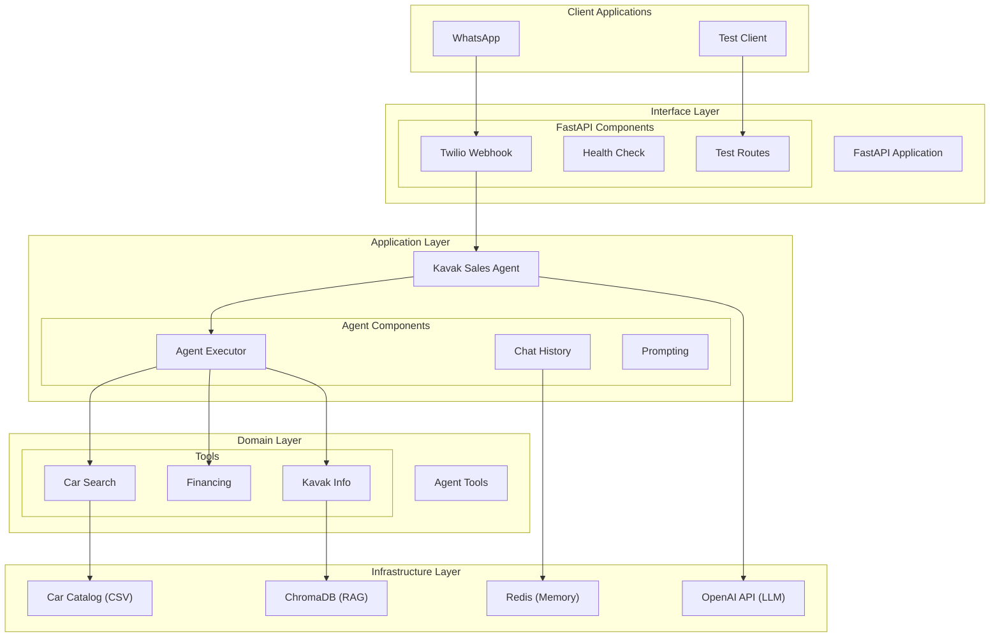

# Kavak AI Sales Agent for WhatsApp

[](https://www.python.org/)
[](https://fastapi.tiangolo.com/)
[](https://python.langchain.com/)
[](https://www.docker.com/)

## Overview

Welcome to the Kavak AI Sales Agent project! This is an intelligent car sales chatbot for the Mexican market, designed to interact with users via WhatsApp. The agent assists users in finding cars, understanding financing options, and answering questions about Kavak's services, all in Spanish (Mexican dialect).

This document provides a comprehensive guide to the project, including its architecture, API reference, and developer guidelines.

## ⚠️ Disclaimer

**Important**: This is an independent project and is not affiliated with, endorsed by, or connected to Kavak in any way. It's a demonstration project only.

## Table of Contents

1. [Overview](#overview)
2. [Key Features](#key-features)
3. [Technical Stack](#technical-stack)
4. [Architecture](#architecture)
    * [Core Principles](#core-principles)
    * [System Diagram](#system-diagram)
    * [Layer Responsibilities](#layer-responsibilities)
    * [Data Flow](#data-flow)
    * [Knowledge Base & RAG System](#knowledge-base--rag-system)
5. [API Reference](#api-reference)
    * [API Endpoints](#api-endpoints)
    * [Agent Tools](#agent-tools-reference)
6. [Developer Guide](#developer-guide)
    * [Development Environment Setup](#development-environment-setup)
    * [Development Workflow](#development-workflow)
    * [Testing](#testing)
    * [Debugging](#debugging)
    * [Performance Optimization](#performance-optimization)
7. [Example Usage](#example-usage)
8. [Disclaimer](#disclaimer)
9. [Future Enhancements](#future-enhancements)

## Key Features

### Car Search & Recommendations

* Search vehicles by budget, make, model, or features
* Get personalized recommendations based on user preferences
* View detailed specifications and pricing

### Financing Tools

* Calculate monthly payments with different down payment options
* Compare financing terms (3-6 years)
* Get detailed amortization schedules
* Budget planning based on desired monthly payment

### Kavak Information

* Learn about Kavak's warranty and certification process
* Get answers to frequently asked questions

### WhatsApp Integration

* Native Spanish language support (Mexican dialect)
* Context-aware conversations

### Developer Experience

* Comprehensive logging system
* Local development with Docker
* Automated testing suite
* API documentation with Swagger UI

## Technical Stack

### Core Technologies

* **FastAPI** - High-performance web framework for building APIs
* **LangChain** - Framework for developing applications powered by language models
* **OpenAI GPT-4o** - Advanced language model for natural language understanding
* **ChromaDB** - Vector database for efficient similarity search
* **Redis** - In-memory data store for conversation memory
* **Docker** - Containerization for consistent development and deployment
* **Twilio** - WhatsApp integration for customer interactions

## Architecture

### Core Principles

The Kavak AI Sales Agent follows a Domain-Driven Design (DDD) approach with elements of Clean Architecture, organizing the codebase into distinct layers with clear responsibilities.

### System Diagram



### Layer Responsibilities

#### Interface Layer

* **Twilio Webhook Handler**: Receives and processes WhatsApp messages
* **Health Check**: Monitors system health and dependencies
* **Test Routes**: Endpoints for testing and development

#### Application Layer

* **Kavak Sales Agent**: Orchestrates the conversation flow
* **Agent Executor**: Executes the agent with tools
* **Chat History**: Manages conversation context
* **Prompting**: Defines system prompts and personas

#### Domain Layer

* **Car Search**: Tools for searching and filtering vehicles
* **Financing**: Tools for calculating payment options
* **Kavak Info**: Tools for retrieving company information

#### Infrastructure Layer

* **Car Catalog**: CSV data source for vehicle information
* **ChromaDB**: Vector database for RAG implementation
* **OpenAI API**: LLM provider for natural language processing
* **Redis**: In-memory database for conversation storage

### Data Flow

1. **User Message Flow**:

    ```ascii
    WhatsApp User → Twilio → FastAPI Webhook → Agent → Tools → Response → WhatsApp
    ```

2. **RAG Query Flow**:

    ```ascii
    User Query → Agent → get_kavak_info Tool → ChromaDB → Response
    ```

3. **Financing Calculation Flow**:

    ```ascii
    User Request → Agent → Financing Tool → Calculation → Formatted Response
    ```

### Knowledge Base & RAG System

The system implements an on-demand Retrieval-Augmented Generation (RAG) approach to provide accurate and up-to-date information about Kavak's services and policies.

#### Components

1. **Scraper** (`scripts/scrape_kavak.py`)
   - Crawls the Kavak website to extract structured knowledge
   - Handles rate limiting and error cases gracefully
   - Outputs structured JSON data for further processing

2. **Knowledge Base Setup** (`scripts/setup_knowledge_base.py`)
   - Processes scraped data and fallback content
   - Creates and populates a ChromaDB vector store
   - Implements text chunking and embedding generation
   - Handles versioning and updates of the knowledge base

3. **Knowledge Integration** (`src/knowledge/kavak_knowledge.py`)
   - Provides an interface to query the vector store
   - Implements semantic search capabilities
   - Manages the RAG pipeline for question answering

#### Usage

To update the knowledge base with the latest information:

```bash
# Scrape the latest data from Kavak's website
make scrape-kavak

# Set up the knowledge base (includes fallback content)
make setup-knowledge
```

#### Fallback Mechanism

The system includes a robust fallback mechanism:

1. **Primary Source**: Scraped data from Kavak's website
2. **Secondary Source**: Pre-defined fallback content for critical information
3. **Versioning**: Tracks when the knowledge was last updated
4. **Validation**: Ensures minimum required knowledge is always available

This approach ensures the system remains functional even when external sources are unavailable, while still providing the most accurate information possible.

### Key Design Patterns

1. **Factory Pattern**: Used in `create_kavak_agent()` to create and configure the agent with tools
2. **Singleton Pattern**: Used for global knowledge base instance

### Redis Conversation Memory

#### Overview

The application uses Redis for persistent conversation memory, enabling stateful interactions with users across multiple sessions.

#### Features

* **Persistence**: Conversation history is preserved across application restarts
* **TTL (Time-To-Live)**: Conversations automatically expire after a configurable period
* **Performance**: In-memory storage ensures low-latency access to conversation history
* **High Availability**: Redis Sentinel support for failover scenarios

#### Configuration

Redis is configured using the following environment variables:

* `REDIS_URL`: Connection URL for Redis (default: `redis://localhost:6379`)
  * Format: `redis://[username:password@]host[:port][/db-number]`
  * Example: `redis://:mypassword@redis-host:6379/0`
* `REDIS_PASSWORD`: Optional password for Redis authentication

#### Docker Compose Setup

The Redis service is pre-configured in `docker-compose.yml` with the following settings:

```yaml
redis:
  image: redis:7-alpine
  container_name: kavak-redis
  ports:
    - "6379:6379"
  volumes:
    - redis_data:/data
  healthcheck:
    test: ["CMD", "redis-cli", "ping"]
    interval: 5s
    timeout: 5s
    retries: 5
  restart: unless-stopped
```

Key features:
* **Persistence**: Data is stored in a Docker volume named `redis_data`
* **Health Checks**: Automatic monitoring of Redis service health
* **Auto-restart**: Service restarts automatically if it fails
* **Resource Limits**: Configured with appropriate memory limits

#### Data Structure

Conversation data is stored using the following Redis data structures:

1. **Conversation History** (List)
   * Key: `conversation:{session_id}`
   * Type: List of JSON-encoded messages
   * TTL: 30 days (configurable)

2. **Session Metadata** (Hash)
   * Key: `session:{session_id}:meta`
   * Fields:
     * `created_at`: Timestamp of session creation
     * `updated_at`: Timestamp of last activity
     * `message_count`: Total messages in conversation

#### Monitoring and Maintenance

To monitor Redis performance and health:

1. **Redis CLI**:
   ```bash
   docker exec -it kavak-redis redis-cli
   ```

2. **Key Metrics**:
   ```bash
   # Check memory usage
   redis-cli info memory
   
   # Monitor connected clients
   redis-cli info clients
   
   # Get all keys matching a pattern
   redis-cli --scan --pattern 'conversation:*' | wc -l
   ```

3. **Backup and Restore**:
   ```bash
   # Create backup
   docker exec kavak-redis redis-cli SAVE
   
   # Copy backup file
   cp /var/lib/docker/volumes/kavak_challenge_commercial_agent_redis_data/_data/dump.rdb /path/to/backup/
   ```
## API Reference

### API Endpoints

#### Root Endpoint

```http
GET /
```

Returns basic information about the API.

**Response Example:**

```json
{
  "message": "¡Hola! Soy el agente comercial de Kavak 🚗",
  "description": "Agente de IA para ayudarte a encontrar tu auto perfecto",
  "endpoints": {
    "health": "/health",
    "docs": "/docs",
    "webhook": "/webhook/whatsapp"
  }
}
```

#### Health Check

```http
GET /health
```

Returns the current status of the service.

**Response Example:**

```json
{
  "status": "OK",
  "service": "Kavak AI Agent",
  "version": "0.1.0",
  "language": "es_MX"
}
```

#### WhatsApp Webhook

```http
POST /webhook/whatsapp
```

Webhook endpoint for receiving and responding to WhatsApp messages via Twilio.

**Form Parameters:**

* `Body` (required): The message text from the user
* `From` (required): User's WhatsApp number with 'whatsapp:' prefix
* `To` (required): Twilio number that received the message
* `MessageSid` (required): Unique message identifier
* `NumMedia` (optional): Number of media files sent with the message

**Response:**
TwiML response for Twilio to send as WhatsApp messages.

**Example Response:**

```xml
<Response>
  <Message>¡Hola! Gracias por tu mensaje. ¿En qué puedo ayudarte hoy? 🚗</Message>
</Response>
```

#### Test Agent Locally

```http
POST /webhook/test
```

Test endpoint for local agent testing without Twilio.

**Request Body:**

```json
{
  "message": "Busco una camioneta familiar",
  "session_id": "test_session"
}
```

**Response Example:**

```json
{
  "response": "¡Hola! Claro, puedo ayudarte a encontrar una camioneta familiar. ¿Tienes alguna preferencia de marca o un presupuesto específico? 🚗",
  "session_id": "test_session",
  "processing_time": 1.25
}
```

#### Clear Conversation

```http
DELETE /webhook/conversation/{session_id}
```

Clear conversation history for a specific session.

**Path Parameters:**
*   `session_id` (required): The ID of the session to clear

**Response Example:**

```json
{
  "success": true,
  "message": "Conversation cleared for session test_session",
  "session_id": "test_session"
}
```

#### List Conversations

```http
GET /webhook/conversations
```

List all active conversation sessions.

**Response Example:**

```json
{
  "conversations": [
    {
      "session_id": "whatsapp_+5215512345678",
      "message_count": 5,
      "last_message": "¿Cuál es el precio de un Honda Civic?",
      "last_updated": "2023-05-28T10:15:30"
    }
  ],
  "count": 1
}
```

### Agent Tools Reference

#### Car Search Tools

##### search_cars_by_budget

Searches for cars within a specific budget range.

**Parameters:**

* `max_price` (float, required): Maximum budget in MXN
* `brand` (string, optional): Car brand to filter by

**Returns:**
Formatted string with search results in Spanish.

##### search_specific_car

Searches for a specific car by make and model.

**Parameters:**

* `brand` (string, required): Car brand
* `model` (string, required): Car model

**Returns:**
Formatted string with search results in Spanish.

##### get_popular_cars

Returns a list of popular cars in the Kavak catalog.

**Parameters:**

None

**Returns:**
Formatted string with popular car models in Spanish.

#### Financing Tools

##### calculate_financing

Calculates financing options for a car.

**Parameters:**

* `car_price` (float, required): Price of the car in MXN
* `down_payment` (float, required): Down payment amount in MXN
* `years` (integer, required): Financing term in years (3-6)

**Returns:**
Formatted string with financing details in Spanish.

##### calculate_multiple_options

Calculates multiple financing scenarios with different terms.

**Parameters:**

* `car_price` (float, required): Price of the car in MXN
* `down_payment` (float, required): Down payment amount in MXN

**Returns:**
Formatted string with multiple financing options in Spanish.

##### calculate_budget_by_monthly_payment

Determines the maximum car price based on desired monthly payment.

**Parameters:**

* `monthly_payment` (float, required): Desired monthly payment in MXN
* `down_payment_percentage` (float, optional): Percentage of down payment (default 20%)
* `years` (integer, optional): Financing term in years (default 4)

**Returns:**
Formatted string with budget estimation in Spanish.

#### Kavak Information Tools

##### get_kavak_info

Retrieves information about Kavak's services, policies, or general FAQs using RAG.

**Parameters:**

* `query` (string, required): User's question about Kavak

**Returns:**
Formatted string with information in Spanish.

## Developer Guide

### Development Environment Setup

#### Prerequisites

* **Core Requirements**
  * Python 3.11+
  * [UV](https://github.com/astral-sh/uv) package manager
  * Docker and Docker Compose

* **API Keys & Accounts**
  * [OpenAI API key](https://platform.openai.com/api-keys)
  * [Twilio account](https://www.twilio.com/try-twilio) (for WhatsApp integration)
  * [ngrok account](https://ngrok.com/) (for local development with WhatsApp)
  * Redis CLI (optional, for debugging)

#### Local Setup

1. **Clone the repository**

    ```bash
    git clone <repository-url>
    cd commercial_agent
    ```

2. **Set up environment variables**

    ```bash
    cp .env.example .env
    ```

    Edit `.env` with your API keys and configuration:
    ```bash
    # API Keys
    OPENAI_API_KEY=your_openai_key_here
    TWILIO_ACCOUNT_SID=your_twilio_sid
    TWILIO_AUTH_TOKEN=your_twilio_token
    TWILIO_PHONE_NUMBER=your_twilio_whatsapp_number
    
    # Optional for local development
    NGROK_AUTHTOKEN=your_ngrok_token
    ```

3. **Install dependencies with UV**

    ```bash
    uv venv
    source .venv/bin/activate  # On Windows: .venv\Scripts\activate
    uv pip install -e .
    ```

4. **Start services with Docker Compose**

    For development with ngrok (recommended for WhatsApp testing):
    ```bash
    docker-compose --profile dev up -d
    ```
    
    Or for core services only:
    ```bash
    docker-compose up -d
    ```

5. **Get the webhook URL** (if using ngrok)
    ```bash
    docker-compose logs -f ngrok-url
    ```
    Copy the webhook URL (e.g., `https://xxxx-xxxx-xxxx.ngrok-free.app/webhook/whatsapp`)

6. **Configure Twilio Webhook**
    - Go to [Twilio Console WhatsApp Sandbox](https://console.twilio.com/us1/develop/sms/try-it-out/whatsapp-learn)
    - Set the webhook URL in the "When a message comes in" field
    - Save changes

### Development Workflow

#### Development Commands

The project includes a `Makefile` with common development tasks:

```bash
# Install/update dependencies
make install-deps

# Format code
make format

# Run linters
make lint

# Run tests
make test

# Run specific test (e.g., tools, webhook)
make test-tools

# Run demo scenarios
make demo

# View logs in real-time
make logs

# Clean temporary files
make clean
```

#### Code Structure

The project follows a Domain-Driven Design (DDD) approach with elements of Clean Architecture:

* **Interface Layer**: FastAPI application and endpoints
* **Application Layer**: Agent implementation and orchestration
* **Domain Layer**: Business logic and tools
* **Infrastructure Layer**: External services integration

#### Adding a New Tool

1. **Create a new tool file**

    Create a new file in `src/tools/` or add to an existing file:

    ```python
    from langchain.tools import tool
    from ..core.logging import get_logger

    logger = get_logger(__name__)

    @tool
    def mi_nueva_herramienta(parametro1: str, parametro2: int) -> str:
        """
        Descripción de la herramienta en español.

        Args:
            parametro1: Descripción del primer parámetro
            parametro2: Descripción del segundo parámetro

        Returns:
            Respuesta en español formateada para WhatsApp
        """
        try:
            # Implementación de la herramienta
            resultado = f"Resultado con {parametro1} y {parametro2}"
            return f"✅ Resultado: {resultado}"
        except Exception as e:
            logger.error(f"Error en mi_nueva_herramienta: {str(e)}")
            return "❌ Lo siento, hubo un problema. Por favor intenta de nuevo."
    ```

2. **Register the tool with the agent**

    Add your tool to the list in `src/webhook/twilio_handler.py`:

    ```python
    def get_kavak_agent():
        """Initialize Kavak agent with all tools"""
        tools = [
            # Existing tools...
            mi_nueva_herramienta,  # Add your new tool here
        ]
        return create_kavak_agent(tools)
    ```

3. **Add tests for your tool**

    Create tests in `tests/` directory:

    ```python
    def test_mi_nueva_herramienta():
        """Test mi_nueva_herramienta functionality"""
        result = mi_nueva_herramienta.invoke({"parametro1": "test", "parametro2": 123})
        assert "✅" in result
        assert "Resultado" in result
    ```


#### Coding Standards

1. **Type Hints**: Use Python type hints for all function parameters and return values
2. **Docstrings**: Add docstrings to all functions and classes
3. **Error Handling**: Implement proper error handling with Spanish user messages
4. **Logging**: Use the logger from `src.core.logging` for consistent logging
5. **Testing**: Write tests for all new functionality

#### WhatsApp Message Optimization

1. **Character Limit**: Keep responses under 1500 characters
2. **Emojis**: Use contextual emojis for better user experience
3. **Formatting**: Use clear formatting for readability on mobile devices
4. **Response Time**: Optimize for quick responses (under 5 seconds)

### Testing

#### Running Tests

The project includes a comprehensive test suite with 87% code coverage. Use the following `make` commands to run tests:

```bash
# Run all tests
make test

# Run specific test types
make test-unit     # Unit tests only
make test-integration  # Integration tests only
make test-e2e      # End-to-end tests only

# Run with coverage report (87% coverage)
make test-cov

# Run specific test file
uv run pytest tests/test_basic.py -v

# Test individual agent tools
make test-tools
```

#### Test Types

1. **Unit Tests**: Test individual functions and classes in isolation
   - Located in `tests/unit/`
   - Fast execution, no external dependencies

2. **Integration Tests**: Test interaction between components
   - Located in `tests/integration/`
   - May include database interactions

3. **End-to-End Tests**: Test complete user flows
   - Located in `tests/e2e/`
   - Test full request/response cycles

4. **Spanish Language Tests**: Verify all user-facing responses are in Spanish
   - Located in `tests/spanish/`
   - Ensure proper localization and formatting

#### Mocking External Services

For testing without calling external APIs:

```python
from unittest.mock import patch

@patch('src.tools.car_search.search_cars_by_budget')
def test_with_mock(mock_search):
    mock_search.return_value = "Encontré 5 autos en tu presupuesto 🚗"
    # Test code here
```

### Debugging

#### Logging

The application uses a hierarchical logging system:

```python
from src.core.logging import get_logger

logger = get_logger(__name__)
logger.debug("Debug message")
logger.info("Info message")
logger.warning("Warning message")
logger.error("Error message", exc_info=True)
```

Logs are written to `logs/kavak_agent.log` with rotation (10MB per file, keeping 3 backups). Log levels can be configured in `.env`:

```bash
# Logging configuration
LOG_LEVEL=INFO  # DEBUG, INFO, WARNING, ERROR, CRITICAL
LOG_FORMAT="%(asctime)s - %(name)s - %(levelname)s - %(message)s [%(filename)s:%(lineno)d]"
```


#### Debugging Tools

1. **FastAPI Debug Mode**: Run with `--reload` for auto-reloading
2. **Agent Verbose Mode**: Set `verbose=True` in the agent executor
3. **Tool Debugging**: Add debug logs in tool implementations
4. **Docker Logs**: Use `docker-compose logs -f` to view container logs

## Deployment

This section outlines the steps to build and deploy the Kavak AI Sales Agent using Docker.

### Prerequisites for Deployment

* Docker installed and running.
* Docker Compose installed.
* A configured `.env` file in the project root (refer to `.env.example`).

### Building Docker Images

The `docker-compose.yml` file defines the services. To build the images:

```bash
docker-compose build
```

This command will build the necessary images for the application (e.g., `kavak-api`, `chromadb`, `redis`).

### Running with Docker Compose

Once the images are built, you can start all services in detached mode:

```bash
docker-compose up -d
```

To view the logs for all services:

```bash
docker-compose logs -f
```

To view logs for a specific service (e.g., `kavak-api`):

```bash
docker-compose logs -f kavak-api
```

### Stopping Services

To stop all running services:

```bash
docker-compose down
```

### Environment Variables

The application relies on environment variables defined in the `.env` file at the root of the project. Ensure this file is correctly configured with necessary API keys (like `OPENAI_API_KEY`, `TWILIO_ACCOUNT_SID`, `TWILIO_AUTH_TOKEN`) and other settings before building or running the containers. The `docker-compose.yml` file is set up to pass these variables to the respective services.

### Accessing the Application

Once the services are running, the FastAPI application will typically be accessible at `http://localhost:8000` (or the port configured in your `.env` and `docker-compose.yml`).

* **API Docs**: `http://localhost:8000/docs`
* **Health Check**: `http://localhost:8000/health`

The WhatsApp webhook endpoint will be `http://<your-ngrok-or-public-url>/webhook/whatsapp`, which you'll need to configure in your Twilio console.

## License

This project is licensed under the MIT License - see the [LICENSE](LICENSE) file for details.
